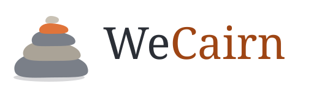
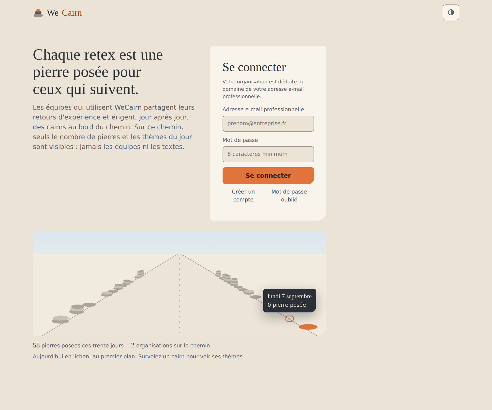
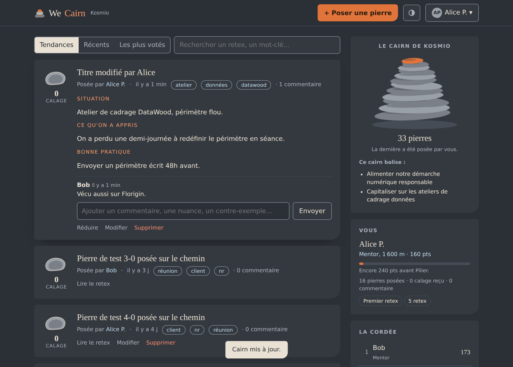

<p align="center">
  
</p>

<p align="center">
  <strong>Chaque retex est une pierre posée sur le chemin pour ceux qui suivent.</strong><br>
  Partage de retours d'expérience en interne, simple, sobre et un peu joueur.
</p>

<p align="center">
  <a href="#démarrer-en-cinq-minutes">Démarrer</a> ·
  <a href="docs/deploiement.md">Déployer</a> ·
  <a href="docs/mcp.md">Connecter Claude</a> ·
  <a href="docs/ia-vocale.md">Partage vocal</a> ·
  <a href="CONTRIBUTING.md">Contribuer</a>
</p>

---

*English summary: WeCairn is a lightweight, self-hosted app for sharing lessons learned (retex, "retour d'expérience") inside an organisation. Each lesson is a stone laid on a cairn; teammates vote ("cale") and comment, and a friendly progression keeps the practice alive. One PocketBase binary, one HTML file, an MCP server so Claude can read and write retex on your behalf, and optional voice capture with Mistral or OpenAI. French UI. MIT licence.*

## Pourquoi

Les retours d'expérience se perdent : dans un compte rendu, dans un fil de discussion, dans la tête de la personne qui
part. WeCairn leur donne un endroit simple où atterrir. Un retex tient en quatre lignes (titre, situation, ce qu'on a
appris, bonne pratique), l'équipe vote pour ceux qui l'aident, et chaque organisation érige son cairn, pierre après pierre.

Sur un sentier de montagne, chacun pose une pierre sur le cairn pour baliser le chemin de ceux qui suivent. C'est
exactement le geste que l'application cherche à encourager.

<p align="center">
  
</p>

## Ce que fait WeCairn

**Poser une pierre.** Un formulaire de quatre champs, des tags, et c'est publié. Les objectifs du cairn, définis par
l'équipe (par exemple « Alimenter notre démarche numérique responsable »), sont rappelés au moment d'écrire. Chacun
peut modifier ou retirer ses propres pierres.

**Caler, commenter, classer.** Le vote « utile » est un galet qu'on cale sous la pierre. Le fil se trie par tendance,
par date ou par votes ; la recherche et les tags filtrent. Les commentaires apportent nuances et contre-exemples.

**Progresser ensemble.** Dix points par pierre, deux par calage reçu, un par calage donné, trois par commentaire.
Cinq niveaux, d'Observateur à Pilier, une altitude qui grimpe, des badges, et « la cordée » : le classement de l'équipe.

**Rester entre soi.** Chaque organisation est isolée : l'inscription rattache automatiquement l'utilisateur au domaine
de son e-mail professionnel, et les règles d'accès sont appliquées par la base de données, pas par l'interface.
L'équipe nomme son organisation et fixe les objectifs de son cairn.

**Alimenter depuis Claude.** Un serveur MCP expose dix outils (lister, chercher, publier, modifier, voter, commenter…)
et un prompt d'extraction de retex depuis une transcription de réunion. Claude agit avec le compte de l'utilisateur,
donc avec ses droits.

**Raconter à l'oral.** Avec une clé Mistral, l'utilisateur dicte son retex et l'IA le structure. Avec une clé OpenAI,
il tient un entretien vocal en temps réel : l'IA écoute, relance, puis remplit le formulaire. Rien n'est publié sans
relecture.

**Le chemin vers l'horizon.** La page d'accueil, sans connexion, montre un chemin bordé de cairns : un par jour, à la
hauteur des pierres posées ce jour-là par toutes les organisations réunies. Au survol, les thèmes du jour. Jamais
les équipes, jamais les textes.

<p align="center">
  
</p>

## Démarrer en cinq minutes

Il faut le binaire PocketBase (un seul fichier, [pocketbase.io/docs](https://pocketbase.io/docs/)).

```bash
git clone https://github.com/Kosmio/wecairn.git && cd wecairn
./pocketbase serve --hooksDir pocketbase/pb_hooks --publicDir web
```

Puis, dans le navigateur :

1. `http://127.0.0.1:8090/_/` : créer le compte superutilisateur.
2. **Settings > Import collections** : charger `pocketbase/pb_schema.json` et valider.
3. `http://127.0.0.1:8090/` : créer un compte avec une adresse e-mail professionnelle, poser la première pierre.

Pour un déploiement (Coolify, Docker), voir [docs/deploiement.md](docs/deploiement.md).

## Comment c'est fait

```
web/index.html                   l'interface, une page, sans build, servie par PocketBase
pocketbase/pb_schema.json        collections, vues SQL (fil, cordée), règles d'accès par organisation
pocketbase/pb_hooks/             rattachement par domaine, normalisation, IA vocale, compte, horizon
mcp/server.js                    serveur MCP (stdio) pour Claude Desktop et Claude Code
Dockerfile, docker-compose.yaml   une image, un volume
docs/                            documentation
```

PocketBase (Go, SQLite) fait tout le travail de fond dans un binaire de quelques dizaines de mégaoctets : authentification,
règles d'accès par enregistrement, API REST, temps réel, console d'administration, sauvegardes S3. L'interface est un
fichier HTML sans dépendance de build. Un conteneur suffit, pour une poignée d'organisations comme pour quelques milliers
de retex. Les choix et leurs limites sont détaillés dans [docs/architecture.md](docs/architecture.md).

## Documentation

| Document | Contenu |
|---|---|
| [docs/architecture.md](docs/architecture.md) | Choix techniques, isolation multi-organisation, limites assumées |
| [docs/modele-de-donnees.md](docs/modele-de-donnees.md) | Collections, vues, règles d'accès, barème de progression |
| [docs/deploiement.md](docs/deploiement.md) | Coolify, Docker, variables d'environnement, sauvegardes, mises à jour |
| [docs/mcp.md](docs/mcp.md) | Connecter Claude : configuration, outils, prompt d'extraction |
| [docs/ia-vocale.md](docs/ia-vocale.md) | Dictée (Mistral) et entretien temps réel (OpenAI), clés, coûts, données |
| [docs/design.md](docs/design.md) | L'univers du Cairn : palette, typographie, vocabulaire, mouvement, thèmes |
| [docs/accessibilite.md](docs/accessibilite.md) | Conformité RGAA / WCAG 2.1 AA, ce qui est vérifié et comment |

## Contribuer

Les contributions sont bienvenues : idées, retours d'usage, corrections, traductions. Lire
[CONTRIBUTING.md](CONTRIBUTING.md) pour l'organisation du code, les tests et les conventions.

## Licence

[MIT](LICENSE). WeCairn est né chez [Kosmio](https://kosm.io), studio de plateformes numériques pour la transition
environnementale et les communs numériques.
